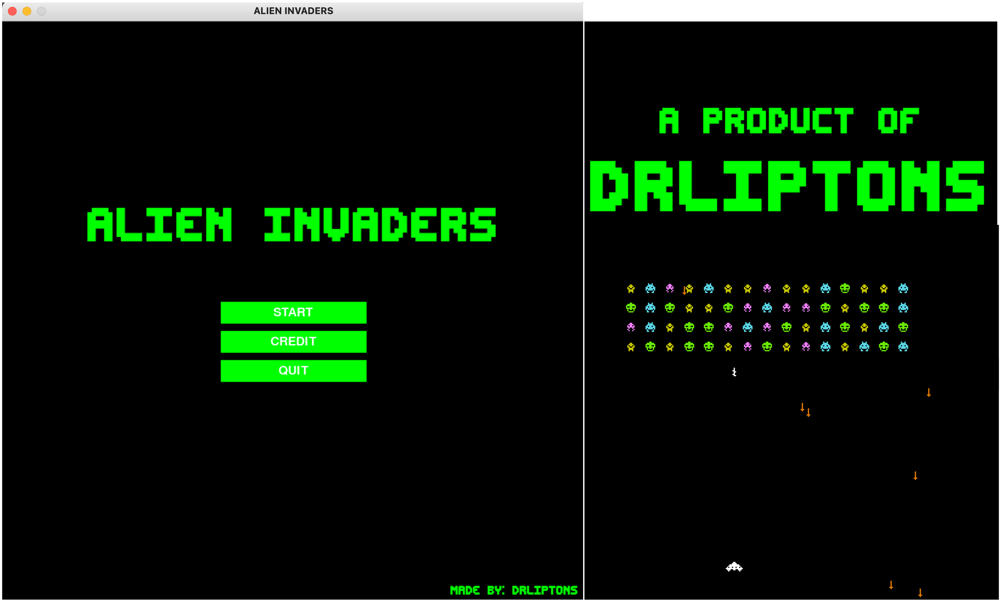

# Alien Invaders

<!-- TABLE OF CONTENTS -->

  
Table of Contents

  <ol>
    <li>
      <a href="#about-the-project">About the Project</a>
    </li>
    <li><a href="#features">Futures</a></li>
    <li><a href="#usage">Usage</a></li>
    <li><a href="#license">License</a></li>
    <li><a href="#acknowledgments">Acknowledgments</a></li>
  </ol>

<!-- ABOUT THE PROJECT -->
## About the Project
Alien Invaders is a game inspired by the original game Space Invaders
by Taito Corporation. Space Invaders was developed by Tomohiro Nishikado
and launched in 1978. The game was a tremendous success with grossed
$3.8 billion. I think we all know how fun this game is. For more information
about the original game [here](https://en.wikipedia.org/wiki/Space_Invaders).

I have spent so many great hours in my childhood playing this game. On one weekend, 
I decided to make a quick clone with python. The game still lacks a couple of
functions, but it was close to what I have expected.

An executable file for macOS can be found in the `application_mac`
folder. Please feel free to check it out.

(<a href="#top">back to top</a>)

<!-- FEATURES -->
## Features
___
The game hasn't as many features or levels as the original game. Considered
that this project was done over a few hours on weekend. However, so far it has;
* Single level gameplay
* Main menu scene, game scene, and a credit scene
* Background sound and sound effects

Based on the amount of fun I had created this project, I might come back later to add
more levels to the game at a later time.

(<a href="#top">back to top</a>)

<!-- USAGE -->
## Usage
___
I made the game for education purposes and have not any intention to sell this app
or any content in this repository. 

(<a href="#top">back to top</a>)

<!-- LICENSE -->
## License
___
Distributed under the MIT License. Please see `LICENSE.md`
for further information

(<a href="#top">back to top</a>)

<!-- ACKNOWLEDGMENTS -->
## Acknowledgments
___
Special thanks to all the artists that made great resources free
to use. 
* Music: Retro Platforming BY David Fesliyan
* Sound effect: Juhan Junkala and Mixkit
* Font: Brian Kent

And of course, for the great creator of the original `SPACE INVADERS`
Tomohiro Nishikado and Taito Corporation.

(<a href="#top">back to top</a>)
